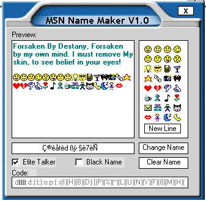



## The Best MSN Name Changer Released\!\!\! \(I think\.\.\.\)

### Description

This is The Best MSN Name Maker Ever!!! No not really, I cant back that up. But its still pretty good. Easy to use GUI with Elite {see Screen Shot). The elite talker is NOT my code and I cant remeber the author. So Many thanx to the dude who submitted that. Please as always LEAVE A COMMENT!!! and it will be most appreciated. :o)
 
### More Info
 

             |
---                |---
**Submitted On**   |2001-11-27 21:02:52
**By**             |[�e7eN](https://github.com/Planet-Source-Code/PSCIndex/blob/master/ByAuthor/e7en.md)
**Level**          |Beginner
**User Rating**    |5.0 (10 globes from 2 users)
**Compatibility**  |VB 6\.0
**Category**       |[Miscellaneous](https://github.com/Planet-Source-Code/PSCIndex/blob/master/ByCategory/miscellaneous__1-1.md)
**World**          |[Visual Basic](https://github.com/Planet-Source-Code/PSCIndex/blob/master/ByWorld/visual-basic.md)
**Archive File**   |[The\_Best\_M3774111272001\.zip](https://github.com/Planet-Source-Code/e7en-the-best-msn-name-changer-released-i-think__1-29252/archive/master.zip)

